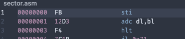

# Generating an "OS" from RNG
### Possibly the dumbest thing I've ever done

So my friend Marca and I were joking about shredding drives using `dd if=/dev/random` when he profferred the opening to a rabbit hole:

Now obviously generating a "completely functional" OS is out the window - being too subjective and also basically impossible.

But if we narrow the definition of "functional OS" to "something that boots and doesn't crash" (as we did) - then you have a challenge.

Marca elected to go down the route of "simulation" - not quite writing an 8086 emulator but implementing enough to verify whether a boot sector met the criteria. This is in principle a more rigourous test as it means that possibly valid operations like memory operations or division can be checked instead of just discarded - at the downside of being a significantly larger endevour.

I decided on the less thorough but still effective approach of going through the 8086's manual and finding opcodes which could not error out. This involved understanding which parts of encodings represented memory vs. register operations and checking the stride of each encoding (i.e. how many 1-byte fetches it would trigger on a real CPU).

The result of my primary endevour was the `nops.txt` file enclosed. This file represents all bit patterns of opcodes whose effects cannot crash the execution, and ferry the IP toward an eventual `hlt`. Then it was simply a case of converting these bit patterns and wildcards into a ludicrous switch statement intermixed with bitwise+logical ops and 
